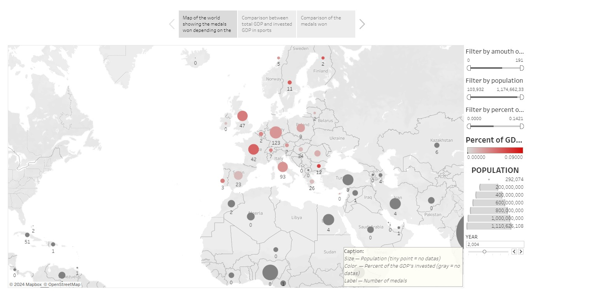
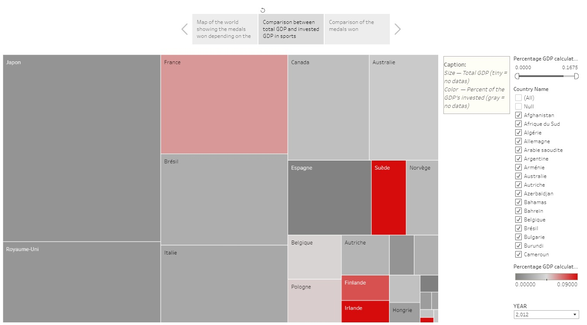
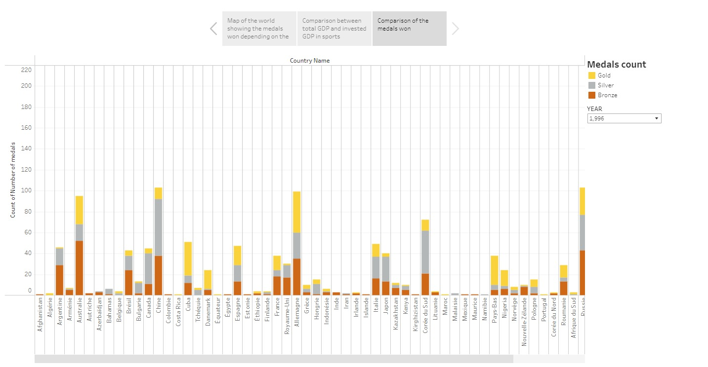
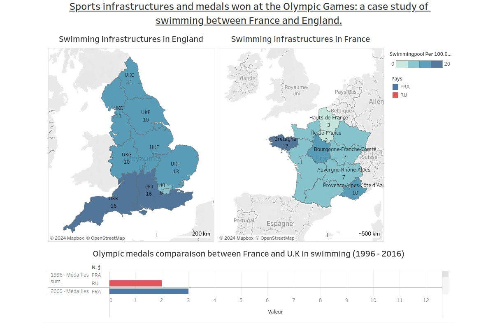

# À propos

Ce fichier contient l'ensemble de nos datavisualisations, élaborées à partir de nos [fichiers csv](../Flux-et-datasets) produits au terme de nos [flux de traitement des données](../Flux-et-datasets). Nous avons réalisé un total de six visualisations, également réparties au sein d'une [histoire](https://public.tableau.com/app/profile/maxime.griveau/viz/Comparisonofthemedalswonbycountryofthe6editionsoftheOlympicGamesaccordingtotheirpopulationandGDPspercentageinvestedinsports/TheOlympicsfortherich) et d'un [tableau de bord](https://public.tableau.com/app/profile/ilyes.mechentel/viz/Natation_Comparaison_UK_France/Tableaudebord1).

## Histoire

Pour consulter l'histoire et les visualisations qui la composent : [Tableau Public](https://public.tableau.com/app/profile/maxime.griveau/viz/Comparisonofthemedalswonbycountryofthe6editionsoftheOlympicGamesaccordingtotheirpopulationandGDPspercentageinvestedinsports/TheOlympicsfortherich)

## Tableau de bord

Pour consulter l'histoire et les visualisations qui la composent : [Tableau Public](https://public.tableau.com/app/profile/ilyes.mechentel/viz/Natation_Comparaison_UK_France/Tableaudebord1)

